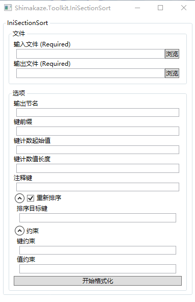

# Shimakaze.Toolkit.IniSectionSort
Red Alert 2 INI文件注册信息表生成工具

该工具可以很方便的取出对应INI节的名字然后生成一个注册表  

## TODO
- [x] 支持输出注册表键数字自增长
- [x] 支持设置注册表键数字长度(短则补0 长则忽略规则)
- [x] 支持设置键前缀
- [x] 输出文件前添加一个节名
- [x] 将特定键的值作为注释添加在对应键值对后
- [x] 限定INI键值
- [ ] 支持正则表达式限定键值
- [x] 按Section名重新排序
- [x] 按特定键的值排序
- [ ] 支持降序

## 鸣谢
使用的项目[Shimakaze.Struct.Ini](https://github.com/ShimakazeProject/Shimakaze.Struct.Ini)  
感谢小星星提供的想法及对本插件进行测试
